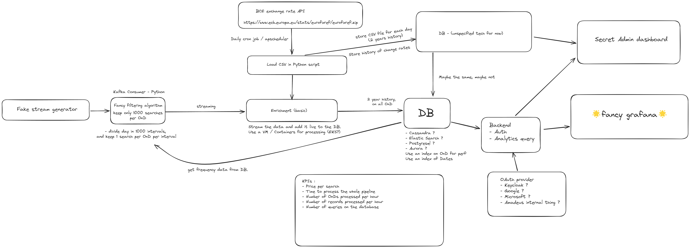

# Amadeus - Air Price Benchmark use case

## Getting started

## Repository structure

Every piece of the diagram has a corresponding root directory

- `fake_stream_generator` - Fake stream generator
- `kafka` - configuration and documentation related to kafka
- `filtering` - Filtering service
- `enrichment` - Enrichement service
- `database` - The main database (DB in the diagram)
- `gui` - A fancy front/backend, not drawn in the diagram (BONUS)

These directories might be empty if there is no code / config associated with this system.

Moreover, we have additional tools to test the reliability of the pipeline.
These are stored inside `benchmark`.